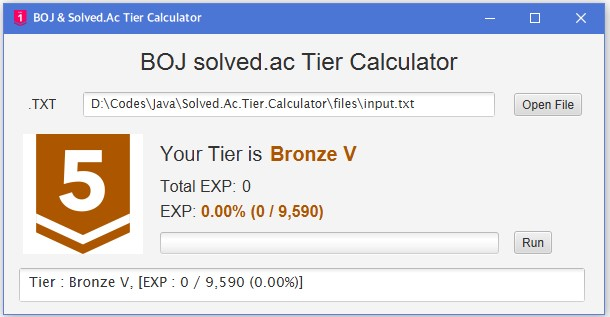

# [solved.ac](https://solved.ac) Tier GUI Calculator
[solved.ac](https://solved.ac)의 경험치 체계에 따라, 유저가 푼 문제들의 티어를 계산해 주는 프로그램입니다.<br />

Based On: **[ddmanager](https://ddmanager.tistory.com/112)'s CUI Calculator**<br />
Language: ```Java```
***
#### GUI 설명
</img>

- ```Open File```: 텍스트 파일 (.txt)을 가져옵니다.
- ```Run```: 불러온 텍스트 파일을 사용해 티어를 계산합니다.
- Process Bar: 현재 티어에서의 경험치를 백분율 상태바로 나타냅니다.
- Text Box: 오류 등의 메시지를 출력합니다.
***
#### 사용 시 유의사항
- 이 프로그램은 **JRE 9 (Java Version 53.0)** 이상의 환경에서 작동됩니다. 그 이하의 버전에서는 JavaFX Module이 지원되지 않습니다.
- 권장 구동 환경은 ```JRE 11 이상```입니다.
- Java를 찾을 수 없어요! → <https://java.com/ko/download/help/path.xml>
***
#### 사용 방법
1. [files](https://github.com/AppliedAlpha/solved_ac_calculator_Java/tree/master/files) 폴더에 들어갑니다.
2. ```SpaceToEndl.exe```를 실행하여 푼 문제 목록을 복사해서 붙여넣고, <u>띄어쓰기 후 **0을 덧붙이고**</u> Enter를 누르면 ```input.txt```에 푼 문제들이 개행되어 저장됩니다.
3. ```calculator_run.bat```을 실행하면 위와 같이 실행된 모습을 볼 수 있습니다. 만약 배치 파일을 사용할 수 없다면, 해당 폴더에서 터미널이나 cmd 등을 실행한 후 다음의 명령어를 입력합니다.
```cmd
start javaw -jar solved_ac_tier_calculator.jar
``` 
4. Open File 버튼을 눌러 ```input.txt```를 불러온 후 Run을 해줍니다. 티어가 나올 때까지 충분한 시간동안 기다려줍니다. **응답 없음을 표출할 수도 있으나 곧 정상화됩니다.**
5. 티어를 확인합니다.